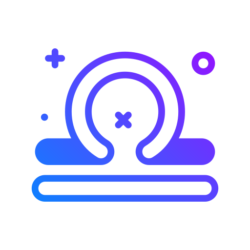

<a id="readme-top"></a>
[![Contributors][contributors-shield]][contributors-url]
[![Forks][forks-shield]][forks-url]
[![Stargazers][stars-shield]][stars-url]
[![Issues][issues-shield]][issues-url]
[![MIT License][license-shield]][license-url]
[![LinkedIn][linkedin-shield]][linkedin-url]


<!-- PROJECT LOGO -->
<br />
<div align="center">
  <a href="https://github.com/othneildrew/Best-README-Template">
    
  </a>

  <h1 className="font-bold text-xl cursor-pointer text-white">
    Libra<span className="text-main">Novel</span>
  </h1>

  <p align="center">
    A website project for reading stories and novels
    <br />
    <a href="https://github.com/supercoderl/Libra-Novel"><strong>Explore the docs »</strong></a>
    <br />
    <br />
    <a href="https://libra-novel.vercel.app/">View Demo</a>
    ·
    <a href="https://github.com/supercoderl/Libra-Novel/issues/new?labels=bug&template=bug-report---.md">Report Bug</a>
    ·
    <a href="https://github.com/supercoderl/Libra-Novel/issues/new?labels=enhancement&template=feature-request---.md">Request Feature</a>
  </p>
</div>


<!-- TABLE OF CONTENTS -->
<details>
  <summary>Table of Contents</summary>
  <ol>
    <li>
      <a href="#about-the-project">About The Project</a>
      <ul>
        <li><a href="#built-with">Built With</a></li>
      </ul>
    </li>
    <li>
      <a href="#getting-started">Getting Started</a>
      <ul>
        <li><a href="#prerequisites">Prerequisites</a></li>
        <li><a href="#installation">Installation</a></li>
      </ul>
    </li>
    <li><a href="#usage">Usage</a></li>
    <li><a href="#contributing">Contributing</a></li>
    <li><a href="#license">License</a></li>
    <li><a href="#contact">Contact</a></li>
  </ol>
</details>


<!-- ABOUT THE PROJECT -->
## About The Project

[![Product Name Screen Shot][product-screenshot]](https://res.cloudinary.com/dcystvroz/image/upload/v1720360162/porsiljwy6zaci2hhmgx.png)

Welcome, and thank you for joining us today. It gives me immense pleasure to introduce you to a project that is very close to my heart: the Libra Novel website.

In a world where stories shape our lives, Libra Novel stands as a beacon for all who seek to immerse themselves in the world of literature. Our mission is simple yet profound: to provide a platform where readers and writers come together to share and discover the magic of novels.

At Libra Novel, we believe that every story deserves to be told and every voice deserves to be heard. Our website offers a diverse collection of novels spanning various genres, from heartwarming romances and thrilling mysteries to thought-provoking science fiction and epic fantasies. Whether you're an avid reader looking for your next great read or a budding author eager to share your masterpiece with the world, Libra Novel is the place for you.

For readers, our user-friendly interface makes it easy to explore new titles, follow your favorite authors, and connect with fellow book lovers. Our recommendation system ensures that you'll always find something that suits your tastes, making every visit to our website a delightful journey into the world of literature.

For writers, Libra Novel provides a supportive community and a platform to showcase your work to a global audience. We understand the passion and effort that goes into crafting a novel, and we are here to help you reach your readers. Our tools and resources are designed to assist you in every step of your creative journey, from writing and editing to publishing and promoting your novel.

<p align="right">(<a href="#readme-top">back to top</a>)</p>

### Built With

This section should list any major frameworks/libraries used to bootstrap your project. Leave any add-ons/plugins for the acknowledgements section. Here are a few examples.

* [![Next][Next.js]][Next-url]
* [![React][React.js]][React-url]
* [![Tailwind][Tailwind.css]][Tailwind-url]
* [![RadixUI][Radix.ui]][Radix-url]
* [![TypeScript][TypeScript.ts]][TypeScript-url]
* [![Swiper][Swiper.ui]][Swiper-url]
* [![Lucide][Lucide.icon]][Lucide-url]
* [![Axios][Axios.api]][Axios-url]
* [![Vercel][Vercel.host]][Vercel-url]

<p align="right">(<a href="#readme-top">back to top</a>)</p>


<!-- GETTING STARTED -->
## Getting Started

This is an example of how you may give instructions on setting up your project locally.
To get a local copy up and running follow these simple example steps.

### Prerequisites

This is an example of how to list things you need to use the software and how to install them.
* npm
  ```sh
  npm install npm@latest -g
  ```

### Installation

_Below is an example of how you can instruct your audience on installing and setting up your app. This template doesn't rely on any external dependencies or services._

1. Get Secret key by ```sh openssl rand -base64 32```
2. Clone the repo
   ```sh
   git clone https://github.com/your_username_/Project-Name.git
   ```
3. Install NPM packages
   ```sh
   npm install
   ```
4. Enter your Secret in `.evn.local`
   ```js
   AUTH_SECRET = 'ENTER SECRET KEY';
   ```

<p align="right">(<a href="#readme-top">back to top</a>)</p>


<!-- USAGE EXAMPLES -->
## Usage

Use this space to show useful examples of how a project can be used. Additional screenshots, code examples and demos work well in this space. You may also link to more resources.

_For more examples, please refer to the [Documentation](https://github.com/supercoderl/Libra-Novel)_

<p align="right">(<a href="#readme-top">back to top</a>)</p>


<!-- CONTRIBUTING -->
## Contributing

Contributions are what make the open source community such an amazing place to learn, inspire, and create. Any contributions you make are **greatly appreciated**.

If you have a suggestion that would make this better, please fork the repo and create a pull request. You can also simply open an issue with the tag "enhancement".
Don't forget to give the project a star! Thanks again!

1. Fork the Project
2. Create your Feature Branch (`git checkout -b feature/AmazingFeature`)
3. Commit your Changes (`git commit -m 'Add some AmazingFeature'`)
4. Push to the Branch (`git push origin feature/AmazingFeature`)
5. Open a Pull Request

<p align="right">(<a href="#readme-top">back to top</a>)</p>


<!-- LICENSE -->
## License

FREE

<p align="right">(<a href="#readme-top">back to top</a>)</p>


<!-- CONTACT -->
## Contact

Minh Quang - [supercoderle](https://www.linkedin.com/in/supercoderle/) - minh.quang1720@gmail.com

Project Link: [https://github.com/your_username/repo_name](https://github.com/your_username/repo_name)

<p align="right">(<a href="#readme-top">back to top</a>)</p>

<!-- MARKDOWN LINKS & IMAGES -->
<!-- https://www.markdownguide.org/basic-syntax/#reference-style-links -->
[contributors-shield]: https://img.shields.io/github/contributors/othneildrew/Best-README-Template.svg?style=for-the-badge
[contributors-url]: https://github.com/othneildrew/Best-README-Template/graphs/contributors
[forks-shield]: https://img.shields.io/github/forks/othneildrew/Best-README-Template.svg?style=for-the-badge
[forks-url]: https://github.com/othneildrew/Best-README-Template/network/members
[stars-shield]: https://img.shields.io/github/stars/othneildrew/Best-README-Template.svg?style=for-the-badge
[stars-url]: https://github.com/othneildrew/Best-README-Template/stargazers
[issues-shield]: https://img.shields.io/github/issues/othneildrew/Best-README-Template.svg?style=for-the-badge
[issues-url]: https://github.com/othneildrew/Best-README-Template/issues
[license-shield]: https://img.shields.io/github/license/othneildrew/Best-README-Template.svg?style=for-the-badge
[license-url]: https://github.com/othneildrew/Best-README-Template/blob/master/LICENSE.txt
[linkedin-shield]: https://img.shields.io/badge/-LinkedIn-black.svg?style=for-the-badge&logo=linkedin&colorB=555
[linkedin-url]: https://linkedin.com/in/othneildrew
[product-screenshot]: https://res.cloudinary.com/dcystvroz/image/upload/v1720360162/porsiljwy6zaci2hhmgx.png
[Next.js]: https://img.shields.io/badge/next.js-000000?style=for-the-badge&logo=nextdotjs&logoColor=white
[Next-url]: https://nextjs.org/
[React.js]: https://img.shields.io/badge/React-20232A?style=for-the-badge&logo=react&logoColor=61DAFB
[React-url]: https://reactjs.org/
[Tailwind.css]: https://img.shields.io/badge/tailwindcss-%2338B2AC.svg?style=for-the-badge&logo=tailwind-css&logoColor=white
[Tailwind-url]: https://tailwindcss.com/
[Radix-url]: https://reactjs.org/
[Radix.ui]: https://img.shields.io/badge/radix%20ui-161618.svg?style=for-the-badge&logo=radix-ui&logoColor=white
[TypeScript-url]: https://www.typescriptlang.org/
[TypeScript.ts]: https://img.shields.io/badge/typescript-%23007ACC.svg?style=for-the-badge&logo=typescript&logoColor=white
[Swiper-url]: https://swiperjs.com/
[Swiper.ui]: https://img.shields.io/badge/Swiper-6332F6?logo=swiper&logoColor=fff&style=for-the-badge
[Lucide-url]: https://lucide.dev/
[Lucide.icon]: https://img.shields.io/badge/ICON-31B8BB?logo=icon&logoColor=fff&style=for-the-badge
[Axios-url]: https://axios-http.com/
[Axios.api]: https://img.shields.io/badge/Axios-5A29E4?logo=axios&logoColor=fff&style=for-the-badge
[Vercel-url]: https://vercel.com/
[Vercel.host]: https://img.shields.io/badge/vercel-%23000000.svg?style=for-the-badge&logo=vercel&logoColor=white